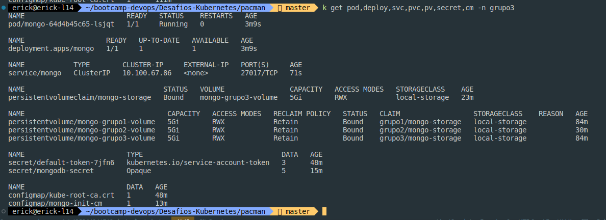
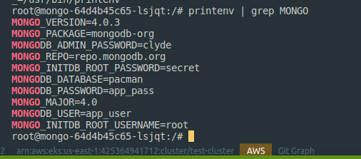
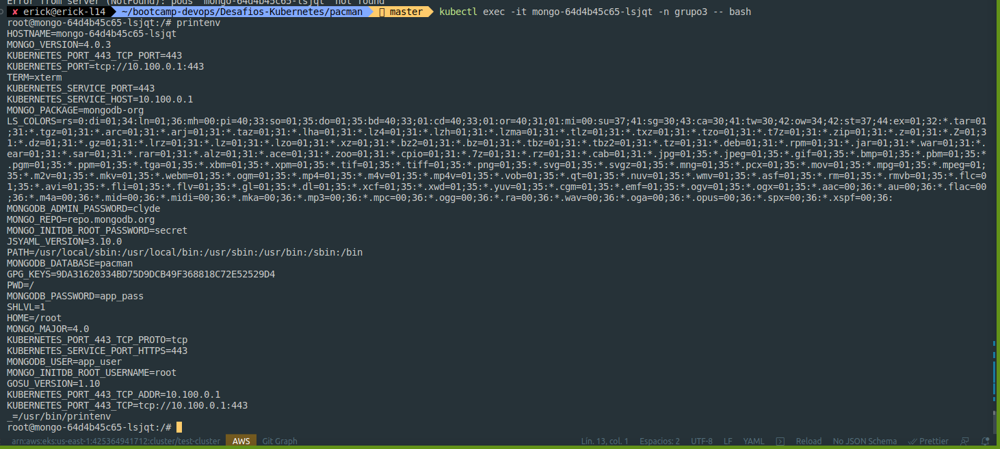
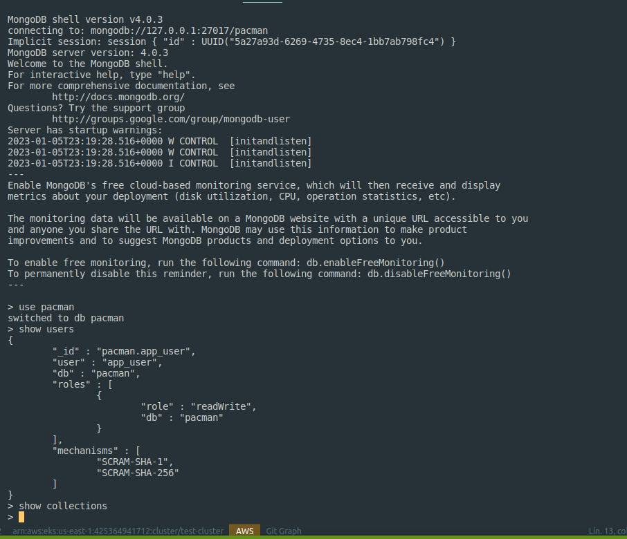
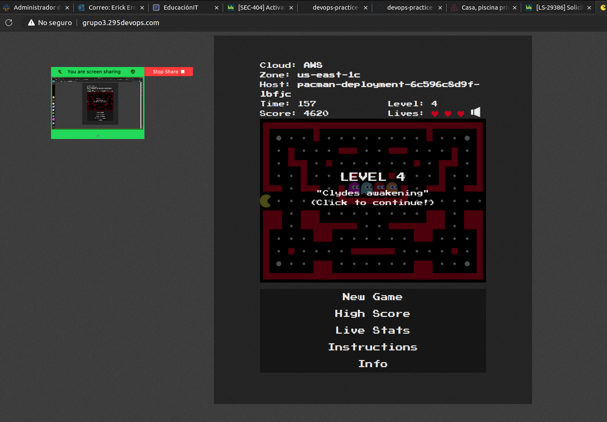

### Pacman APP running into EKS cluster into AWS.

```
aws configure (configuramos las llaves programáticas)
aws sts get-caller-identity
aws eks update-kubeconfig --name test-cluster --region us-east-1
kubectl get po -A

```

   Creamos los archivos de despliegue, validamos conexiones y procedemos con la validación del juego y los insert en la BD

## History commands

```
aws configure 
aws s3 ls
aws sts get-caller-identity
kubectl get po -A
aws eks update-kubeconfig --name test-cluster --region us-east-1
kubectl get po -A
history
kubectl get po -A
kubectl get namespace
kubectl apply -f pacman.yml
kubectl apply -f pacman.yml -n grupo3
kubectl get pv
kubectl apply -f pacman.yml -n grupo3
kubectl apply -f pvc.yml
kubectl get pv
kubectl get pvc
kubectl get pvc -n grupo3
echo 'app_user' | base64
echo 'root' | base64
echo -n 'root' | base64
echo -n 'secret' | base64
echo -n 'app_user' | base64
echo -n 'app_pass' | base64
kubectl apply -f secret/secret.yml
kubectl get secret 
kubectl get secret -n grupo3
kubectl apply -f bd/configmap.yml
kubectl get cm -n grupo3
kubectl apply -f bd/deployment.yml
kubectl get deployment
kubectl get deployment -n grupo3
kubectl apply -f bd/service.yml
kubectl get svc -n development
kubectl get svc -n grupo3
k get pod,deploy,svc,pvc,pv,secret,cm
k get pod,deploy,svc,pvc,pv,secret,cm -n grupo3
kubectl exec -it pod/mongo-64d4b45c65-lsjqt -- bash
kubectl exec -it mongo-64d4b45c65-lsjqt -- bash
kubectl exec -it mongo-64d4b45c65-lsjqt -n grupo3 -- bash
kubectl get deployment -n grupo3
kubectl apply -f secret/secret.yml
kubectl apply -f app/pacman.yml
kubectl get po -A
kubectl apply -f app/serviceapp.yml
kubectl apply -f app/ingressapp.yml
kubectl get po -A
k get ingress
kd -f app/ingressapp.yml
ka -f app/ingressapp.yml
kubectl apply -f app/ingressapp.yml
k get ingress -A
k get ingress -n grupo3
kubectl get po -A
k exec -it pacman-deployment-6c596c8d9f-64c8l -n grupo3 -- sh
k get logs pacman-deployment-6c596c8d9f-64c8l -n grupo3
k  logs pacman-deployment-6c596c8d9f-64c8l -n grupo3
kubectl apply -f app/ingressapp.yml
k get ingress -n grupo3
kubectl apply -f app/ingressapp.yml app/serviceapp.yml
kubectl apply -f app/ingressapp.yml
kubectl apply -f app/serviceapp.yml
kubectl apply -f app/pacman.yml
k  logs pacman-deployment-6c596c8d9f-64c8l -n grupo3

::::test docker image locally::::

docker run -d -p 8080:5000 --name pacman roxsross12/pacman:1.0.1
docker ps
docker logs 9f558dd99f6e
docker exec -it 9f558dd99f6e bash
docker exec -it 9f558dd99f6e sh
docker rm -f 9f558dd99f6e
docker ps

::::continue with kubernetes::::

k exec -it pacman-deployment-6c596c8d9f-64c8l -n grupo3 -- sh
kubectl apply -f app/ingressapp.yml
k get ingress -n grupo3
k logs  pacman-deployment-6c596c8d9f-64c8l -n grupo3
kubectl exec -it mongo-64d4b45c65-lsjqt -n grupo3 -- bash
```

### Evidencias:

- Verificacion-pvc
  
  


- Verificacion-deployment-app
  


- Verificacion-deployment-mongo
  


- Variables-mongodb1
  


- Variables-mongodb2



- MongoDB funcionando
  


- App Funcionando
  



- App historicos Web 
  


- App insertando datos en la mongoDB
  


- Registros en la BD mongo (se registra una vez se pierde en el juego y graba el record dentro del historico)
  


